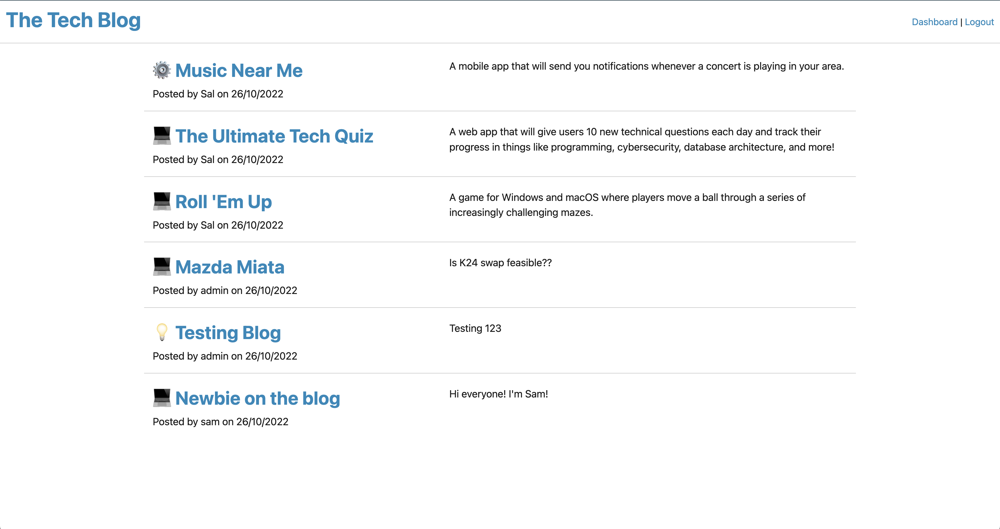
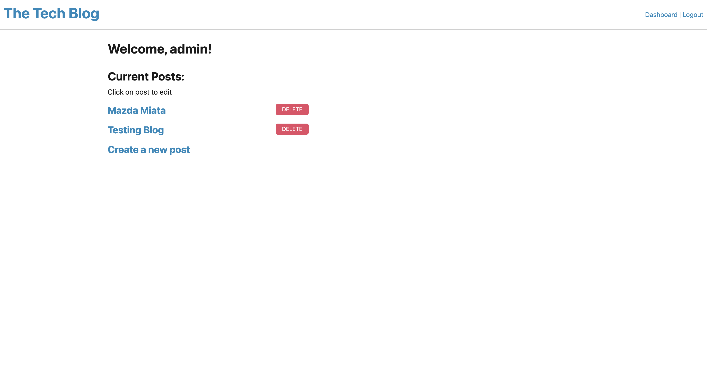
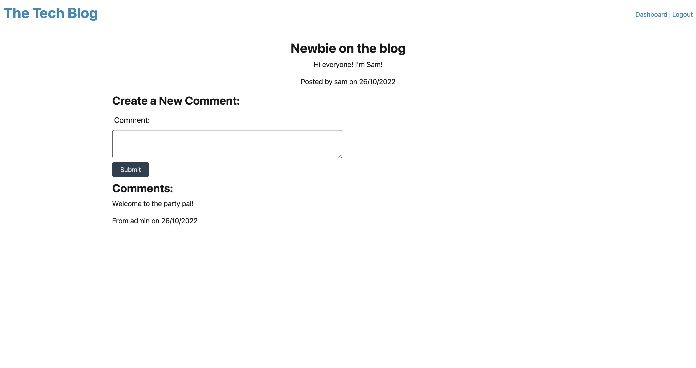

# 14-MVC-Challenge

## Deployed Link
https://challenge-14-blog.herokuapp.com/

## Link to GitHub Repo
https://github.com/paksin/14-MVC-Challenge

## Description

Writing about tech can be just as important as making it. Developers spend plenty of time creating new applications and debugging existing codebases, but most developers also spend at least some of their time reading and writing about technical concepts, recent advancements, and new technologies. A simple Google search for any concept covered in this course returns thousands of think pieces and tutorials from developers of all skill levels!

This week's challenge is to build a CMS-style blog site similar to a Wordpress site, where developers can publish their blog posts and comment on other developers’ posts as well. The app follows the MVC paradigm in its architectural structure, using Handlebars.js as the templating language, Sequelize as the ORM, and the express-session npm package for authentication.

## Mock-Up

 
 
 
